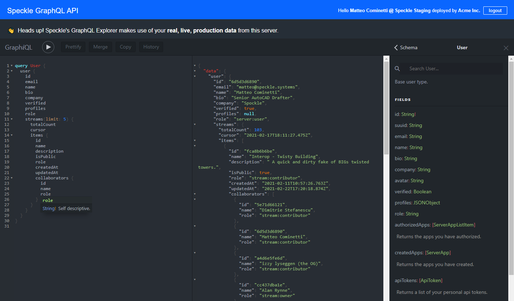

# Introduction

Speckle server, frontend and viewer are hosted in our [speckle-server](https://github.com/specklesystems/speckle-server) repo, each project has its own folder and readme with instructions on how to build it.

## Server API

The primary API of the Speckle Server is a GraphQL one. 

The best way to explore and understand the Server API is to use our interactive explorer that come bundled with the server. 

:::warning 

Any queries and mutations that you execute through the exploer will use the actual data from the server - take care!

:::

### GraphIQL

Simply head to `YOUR-SERVER-ADDRESS/explorer`, and on the right panel you'll be able to see the API docs and schemas. After logging in you'll also be able to execute queries and mutations as the logged in user.

### GraphQL Explorer

Alternatively, the classic GraphQL explorer is also available at `YOUR-SERVER-ADDRESS/graphql`.

To authenticate, you will need to pass in a personal access token in the authorization header: 

