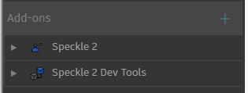
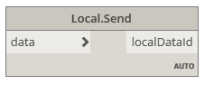
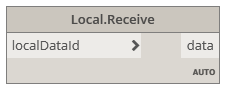
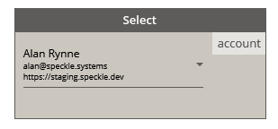
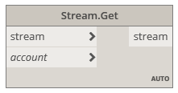
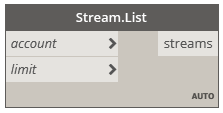
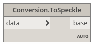
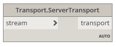
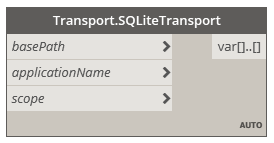

# Dynamo Connector

Once installed, the **Dynamo Connector** will appear under the `Speckle 2` and `Speckle 2 Dev Tools` tabs.

The `Speckle 2` tab contains the main nodes necessary to operate with Speckle, including send/receive nodes, streams and accounts.

The `Speckle 2 Dev Tools` tabs contain nodes for more advanced use-cases, as well as some handy tools for Speckle developers/hackers.

## Sending Data

Let's look at how we would send some data in Dynamo. First, start by creating a new `Send` node.

In order to send some data to the server, we will also need to _create a stream_. We can do this by double clicking the canvas and searching for the `Stream Create` node.

### Creating a stream

To create a new stream, right-click on the canvas and search for the `Stream Create` node. This node has a custom UI that allows you to select a specific account to use, and a button to confirm the stream creation.

Once created, the node will remember that stream. Meaning you will not be able to _change_ the stream you created, or create a new one using the same node (just create a new `Stream Create` node).

Select the appropriate account and press the blue button. If the stream creation was successfull, the output of the node should be a _stream url_ pointing to the newly created stream and linked to the specified account.

### Adding objects

In order to select which objects to send in Dynamo, we just need to connect the desired nodes to the `data` input in the `Send` node. The sender will convert any Dynamo objects into a Speckle compatible format when necessary.

### Create a commit

The only thing left to do is to connect the `Stream Create` output to the `Stream` input in the `Send` node, and then press the **Send button**.

You should see the progress report in the lower side of the Send node, and once finished, you will get a notification with some basic info.

To view the data you just sent from Dynamo in the server, you can use the `View Online` node. Just plug in the `stream`, `branch` or `commit` url and click the button.

## Receiving Data

Receiving data is a very simple operation. You just need to create a `Receive` node, and connect to it a panel with the _stream url_ we obtained from the send operation.

Once connected, just press _"Receive"_, and you should see the node reporting the current progress. After the process has been completed, you could inspect the data you just received using Dynamo's inspection tools.

## Creating custom objects

In Dynamo, working with dictionaries is natively supported, so creating custom objects is as simple as creating a dictionary containing the keys and values you wish to include in the `Base` object.

This dictionary will be automatically converted to a `Base` object during the _Send_ operation.

> Know more about the Speckle `Base` object [here](./../../concepts.md#the-base-object) 👈

## Using Streams in Dynamo

> If you want to know more about streams, go [here](./../../concepts.md#streams) 👈

You can instantiate a stream by copy/pasting the stream url from your server into a `string` node.

<!-- TODO: Add image of stream -->

### Working with branches

Branches cannot be created or directly selected in the Dynamo connector, but all `Stream` inputs accept _branch url's_ that you can copy directly from the server's website. When using a _stream url_ with no branch, the default branch will be used (`main`)

> Want to know more about `branches` in Speckle? Go [here](./../../concepts.md#branches) 👈

## Nodes

### Send/Receive

#### Send node

The **Send node** performs sending operations, usually to a Speckle Server, but also supports sending to a different data storage using _transports_. Whenever possible, the _Send_ node wil try to convert any Rhino-compatible objects into Speckle format.

There is also an switch you can toggle to enable the node to send automatically the data whenever it changes.

##### Input

- _Data_: This port will accept almost anything you give it. If the objects provided are not `Base` objects, it will also perform the conversion to Speckle automatically.
- _Stream_: Supports any generated stream from within the `Stream` component category, but also _stream urls_ in text format.
- _Message_: The message you want to attach to the _commit_ when you send the data. Defaults to `"Dynamo push"`.

##### Output

- _Stream_: The _commit url_ pointing to the objects in the Speckle server.

#### Receive node

The **Receive node** fetches data from a specified `Stream` or any other valid `Transport`. Whenever possible, the receiver node will try to convert all Speckle objects into Rhino-compatible objects.

##### Inputs

- _Stream_: Supports any generated stream from within the `Stream` component category, but also _stream urls_ in text format.

##### Outputs

- _Data_: The data that was received from the stream.

#### Local Send node

The **Local Send** node performs sending operations directly to the users's local database.

##### Inputs

- _Data_: The data to be sent locally. This port will accept almost anything you give it. If the objects provided are not `Base` objects, it will also perform the conversion to Speckle automatically.

##### Outputs

- _localDataId_: The unique `id` for the data that was locally sent.

#### Local receive node

The **Local Receive** node performs receive operations in the same way as the [Receive node](#receive-node), the only difference is that data is received locally from the Speckle's user local database, instead of the server or any other transport.

##### Inputs

- _localDataId_: The unique `id` for the data you want to fetch locally. This would be provided from a [Local Send node](#local-send-node)

##### Outputs

- _Data_: The data thas was received. This port will accept almost anything you give it. If the objects provided are not `Base` objects, it will also perform the conversion to Speckle automatically.

### Streams & Accounts

#### Accounts node

The **Accounts** node provides a fast way of selecting different Speckle accounts.

> Accounts must be set-up in your computer using the **Speckle Manager**. If no accounts are shown after setting up the solution

#### Create stream

##### Inputs

> This node has no inputs, as the account selection is done using it's custom UI.

##### Ouputs

- _stream_: A `Stream` object pointing to the newly created stream.

#### Get stream

The **Stream Get** node will try to find an existing `Stream`, given it's unique `id` (or its `stream url`) and a specific account to access that stream with.

##### Inputs

- _stream_: Supports any generated stream from within the `Stream` component category, but also _stream urls_ in text format.
- _account_: A Speckle account, provided by the **Accounts node**. If no account is provided, the _default account_ will be used.

##### Outputs

- _stream_: A `Stream` object pointing to existing stream. If the stream doesn't exist, an error will be shown.

#### List streams

The **List Streams** node returns a specified ammount of streams available in an account. For performance reasons, it has been limited to fetching a maximum of 20 streams.

##### Inputs

- _account_: A Speckle account, provided by the **Accounts node**. If no account is provided, the _default account_ will be used.
- _limit_: The number of streams to fetch from the server.

##### Outputs

- _streams_: List of `Stream` objects available to the specified account.

#### Stream details

The **Stream Details** node returns all relevant information related to a specific `Stream`.

##### Inputs

- _stream_: Supports any generated stream from within the `Stream` component category, but also _stream urls_ in text format.

##### Output

- _stream_: The unique `id` that identies the stream.
- _name_: The name of the stream.
- _description_: The description of the stream.
- _createdAt_: The date this stream was created.
- _updatedAt_: The date marking the last time the stream was updated.
- _public_: Boolean value indicating if the stream has _link sharing_ enabled.
- _collaborators_: A list of collaborators that have access to this stream, as well as their roles.
- _branches_: A list of available branches for this stream.

#### Stream update

The **Stream Update** node allows for updating the _name_, _description_ and _link sharing_ (which will make your data publicly available to read by anyone with the _stream url_)

##### Inputs

- _stream_: Supports any generated stream from within the `Stream` component category, but also _stream urls_ in text format.
- _name (optional)_: Text string with the new name for the stream.
- _description (optional)_: Text string with the new description for the stream.
- _isPublic_: Boolean value to activate/deactivate this stream's _link sharing_.

##### Output

- _stream_: A `Stream` url pointing to the updated stream.

### Devtools - Conversion

These nodes where developed exclusively for testing/development purposes. If you don't know what these are, you most likely won't ever need them.

#### Convert to Speckle node

The **Convert to Speckle** node will try to convert any Rhino objects (such as lines, curves, meshes...) into Speckle objects.

This node was developed for testing/development purposes, as the Send/Receive nodes will already perform this conversion step automatically.

#### Convert to Native node

The **Convert to Native** node will try to convert any Speckle objects into Rhino compatible objects.

This node was developed for testing/development purposes, as any _Kit Selection_-capable component will already perform this conversion step.

#### Serialize Speckle objects node

The **Serialize objects** node will convert any Speckle object into `JSON` formatted text.

#### Deserialize Speckle objects node

The **Deserialize objects** node will convert a serialized speckle object in json format into `Base` speckle objects.

### Dev Tools - Transports

**Transports** represent a connection to the specific place your data is being saved to, and can be retreived from.

The most used transport at the moment is the **Server Transport**, as it is used to send and receive data from a specific Speckle server; although others are available too.

#### Server Transport

Creates a connection to a specific Speckle Server.

#### SQLite Transport

Creates a connection to a specific SQLite database.

#### Disk Transport

Creates a connection to a specific file in the computer's disk, where the data will be saved in JSON format.

#### Memory Transport

Creates a connection to in-memory storage.
