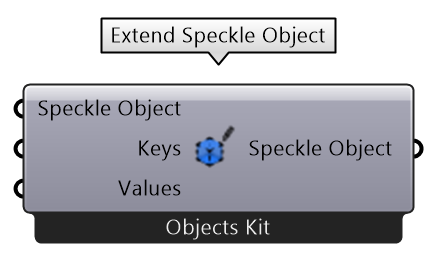

# Grasshopper

Speckle currently supports Grasshopper for McNeel Rhino 6 and 7.

## Getting Started

To install this connector and add your Speckle account proceed by following the instructions in [Speckle Manager](/user/manager).

Once installed, the **Grasshopper Connector** will appear under the `Speckle 2` tab, or if you use _tab icons_ you'll see our new Speckle logo instead.

The connector is divided into 2 main categories, on the Speckle 2 category you will find:

- The Send/Receive nodes
- Account category, holding all account related nodes.
- Stream category, holding all stream related nodes.

You'll also find the `Speckle 2Dev`. These categories hold nodes designed for advanced users and developers:

- Dev/Conversion: Conversion + serialization nodes.
- Dev/Transports: Not sure what transports are? Check [this](/dev/transports.md) out!

## Streams and URLs

In visual programming environments, Speckle Streams are now identified by their URLs (instead of their IDs).
Across our Dynamo and Grasshopper connectors you'll see URLs in 3 different formats:

- `https://speckle.xyz/streams/3073b96e86` points to the `main` branch on Stream `3073b96e86`
- `https://speckle.xyz/streams/3073b96e86/branches/dev` points to a branch named `dev` on Stream `3073b96e86`
- `https://speckle.xyz/streams/3073b96e86/commits/604bea8cc6` points to a specific commit `604bea8cc6` on Stream `3073b96e86`

::: tip
Unsure about what _commits_ and _branches_ are? No worries, you don't need to know what they are to use Speckle! But if you're curios, you can read about them in [concepts](/user/concepts).
:::

We'll see how branch and commit URLs are used in the following sections.

## Sending Data

Let's look at how we would send some data in grasshopper. First, start by creating a new `Send` node.

In order to select which stream to send data to, you just need to pass a stream URL to the stream port.

Alternatively, you can also use one of the following nodes to create / retrieve existing streams:

- [create stream](user/grasshopper.md#create-stream)
- [get stream](user/grasshopper.md#get-stream)
- [list streams](user/grasshopper.md#list-streams)

:::tip NOTE
You cannot send data to a specific commit. Commits represent your stream in a specific point in time and cannot be edited.
:::

#### Adding objects

In order to select which objects to send in grasshopper, we just need to connect the desired nodes to the `Data` input in the `Send` node. The sender supports any type of data, in any structure (item, list, datatree), and will convert any supported Rhino objects into a Speckle compatible format when necessary.

#### Adding a commit message

It's good practice to add a "commit message" whenever you send you data, especially if working with others, this message should describe the changes being pushed.
You can add a commit message by passing some text to the `message` port.
The commit message will be visible in Speckle Web where you will also be allowed to edit it.

#### Sending

The only thing left to do is to press the **Send button**.

::: tip
To view the data you just sent in Grasshopper, just right-click the `Send` node and select the `View commit ...` option. This should open a new browser window loading the _stream url_. You can share that url with any collaborators so they can receive the data.

:::

### Sending to a specific branch

When using a stream URL, by default, the `main` branch is used to send and receive data.

To send to a specific branch, simply use the branch URL, ie: `https://speckle.xyz/streams/3073b96e86/branches/dev`.

## Receiving Data

Receiving data is very simple. You just need a `Receive` node, and a stream URL.

When new data is pushed to this stream a notification will appear on the receive node.

### Auto Receiving

By right clicking on the node, you can enable/disable auto receiving. If enabled, new data pushed to this stream will be pulled automatically as it's available.

### Receiving a specific branch

As mentioned earlier, when using a stream URL, by default, the `main` branch is used to send and receive data.

To receive from a specific branch, simply use the branch URL, ie: `https://speckle.xyz/streams/3073b96e86/branches/dev`.

### Receiving a specific commit

There are circumstances in which you will not want to always receive "new" data, but you'll instead want to only get a specific commit. To do so simply use the commit URL, ie: `https://speckle.xyz/streams/3073b96e86/commits/604bea8cc6`

::: tip NOTE

When receiving from a commit, the node will stop showing notifications about new activity on such stream and the auto receive toggle will be disabled.

:::

### Receiving a specific object

Similarly to commits, you can also point the receive node to a specific object, to do so simply use the commit URL, ie: `https://speckle.xyz/streams/3073b96e86/objects/df7b8bafccefa791d82939dd36541189`. Objects are immutable, so the data received using such a URL will always be consistent.
You can find the ID of an object from the Speckle Web interface:

## Creating custom objects

A custom object is a [Base Object](/user/concepts.html#the-base-object) with custom properties assigned to it. It's basically a custom data structure you can create to send data in a specific format that you define.

There's several different ways to create custom speckle objects using the Grasshopper. One of them is using the `Create Speckle Object` node.

This node is a _variable parameter_ type, meaning if you zoom into the _inputs_ section, you should see a `+/-` sign that will allow you to add/remove properties from the object. Each input you define will represent a new property on the object. You can also modify the name of these properties, as well as their _access type_.

<!-- > This node is capable of [Kit Selection](#object-conversion-and-kits) -->

#### Modifying the access type

Access type operates in the same way as the `Python` and `C#` script components. In this case, you can specify if you want a specific property in the object to be a _list_ or a single _item_.
i.e. If you plug a list of numbers into a `Create Speckle Object` node, depending on the specified access of that property you will get 2 different results:

- **Item access**: The result will be a **list** of base objects, with only one item each.
  
- **List accesss**: The result will be **one** base object, with the entire list of items saved in the property.
  

#### Detach/Do not detach

Every property can also be specified as _detached/non-detached_. When a property is _detached_, it means that the objects it contains will be saved as independent entities in the Speckle database. All properties are detached by default for performance reasons, but you can choose not to by specifying `Do not detach` on the right-click menu.

## Schema Builder

The **Schema Builder** node is a very powerful one. It works similarly to the node above as it allows to create custom objects, but it does so by following pre-existing schemas. To learn more about [schemas and kits](/dev/kits) check out or dev section.

By default the Schema Builder node comes with a series of types, these include mainly building elements to enhance interoperability between Rhino/Grasshopper and other BIM software solutions like Revit.

When a new **Schema Builder** node is created, a pop-up window will be displayed prompting the user to select a specific object schema. This schema will be used to populate the input/output ports of the node with the appropriate fields.

::: tip
Check out our [tutorial on sending data from Grasshopper to Revit](/user/interop-gh-revit)!
:::

<!-- ## Object conversion and Kits

Speckle 2.0 comes with one Kit pre-installed, the `Objects Kit`. This kit is in charge of all conversions to and from Speckle, but other kits may be introduced in the future, leaving the decision to choose which kit to use at each given time to the end-user.

Once a document is open in Grasshopper, you will find a `Speckle 2` application menu that will allow you to specify the appropriate kit to use by default.

This will set the kit to be used by any newly created components in your Grasshopper canvas.

When necessary, you can always adjust the kit being used at each individual component by right-clicking it. The _right-click_ menu should display the same kit selection items. This menu should be available on any component that performs object conversions (most object-management, send, receive...).

You can also distinguish them by the message displaying the selected kit under the component.

 -->

## Nodes

### Send node

The **Send node** performs sending operations, usually to a Speckle Server, but also supports sending to a different data storage using _transports_. Whenever possible, the _Send_ node wil try to convert any Rhino-compatible objects into Speckle format.

There is also an option to set the node to automátically send every time there is a change in the data. You will find this option in the right-click menu of the node.

|  |  |
| ---------------------------------------------------------------------------- | --------------------------------------------------------------------------- |

<!-- > This node is capable of [Kit Selection](#object-conversion-and-kits) -->

#### Input

- _Data_: This port will accept almost anything you give it. If the objects provided are not `Base` objects, it will also perform the conversion to Speckle automatically.
- _Stream_: Supports any generated stream from within the `Stream` component category, but also _stream urls_ in text format.
- _Message_: The message you want to attach to the _commit_ when you send the data. Defaults to `"Grasshopper push"`.

#### Output

- _Stream_: The _commit url_ pointing to the objects in the Speckle server.

### Receive node

The **Receive node** fetches data from a specified `Stream` or any other valid `Transport`. Whenever possible, the receiver node will try to convert all Speckle objects into Rhino-compatible objects.

<!-- > This node is capable of [Kit Selection](#object-conversion-and-kits) -->

#### Inputs

- _Stream_: Supports any generated stream from within the `Stream` component category, but also _stream urls_ in text format.

#### Outputs

- _Data_: The data that was received from the stream.

### Local Send node

The **Local Send** node performs sending operations directly to the users's local database.

<!-- > This node is capable of [Kit Selection](#object-conversion-and-kits) -->

#### Inputs

- _Data_: The data to be sent locally. This port will accept almost anything you give it. If the objects provided are not `Base` objects, it will also perform the conversion to Speckle automatically.

#### Outputs

- _localDataId_: The unique `id` for the data that was locally sent.

### Local receive node

The **Local Receive** node performs receive operations in the same way as the [Receive node](#receive-node), the only difference is that data is received locally from the Speckle's user local database, instead of the server or any other transport.

<!-- > This node is capable of [Kit Selection](#object-conversion-and-kits) -->

#### Inputs

- _localDataId_: The unique `id` for the data you want to fetch locally. This would be provided from a [Local Send node](#local-send-node)

#### Outputs

- _Data_: The data thas was received. This port will accept almost anything you give it. If the objects provided are not `Base` objects, it will also perform the conversion to Speckle automatically.

### Create Speckle Object

Please refer to the [Creating custom objects](/user/grasshopper.html#creating-custom-objects) section.

### Create Speckle Object by Key/Value pairs

This node will create a new speckle object using a list of `Keys` to be used as the object's properties, and a list of values (or nested list) to assign to each property.

<!-- > This node is capable of [Kit Selection](#object-conversion-and-kits) -->

> When using this component, there is no option to specify a properties `detached` state, so all props will be detached by default.

> Notice when creating list items, the data structure must mach. Meaning, the keys and values for each object must start with the same branch index.

### Expand Speckle Object

The **Expand Speckle Object** works in the exact oposite way as the [Create Speckle Object](#create-speckle-object). When a `Base` object is plugged into the input, it will automatically create the outputs for each of the `Base` objects properties.

<!-- > This node is capable of [Kit Selection](#object-conversion-and-kits) -->

#### Inputs

- `Speckle Object`: The speckle object to extract the properties from.

#### Outputs

Outputs are dynamically generated according to the specific Base objects that have to be expanded.
All outputs will appear in alphabetical order regardless on the order they were created/added to the object.

### Extend Speckle Object

The **Extend Speckle Object** provides a way to add new properties to an already existing `Base` object.

<!-- > This node is capable of [Kit Selection](#object-conversion-and-kits) -->

#### Inputs

- _Speckle Object_: The Speckle object to be extended.
- _Keys_: The Keys to extend the object with. When an existing key is overriden, a warning will be displayed.
- _Values_: The values to assign to each individual key. Works in the same way as the [Create Object by KeyValue node](#create-speckle-object-by-keyvalue-pairs)

#### Outputs

- _Speckle Object_: The extended/updated Speckle `Base` object.

### Schema Builder

Please refer to the [Using the Schema Builder](/user/grasshopper.html#schema-builder) section.

<!-- > This node is capable of [Kit Selection](#object-conversion-and-kits) -->

#### Inputs

Inputs are dynamically generated based on the user selected schema.

#### Outputs

Output is dynamically generated based on the user selected schema.

### Accounts node

The **Accounts** node provides a fast way of selecting different Speckle accounts. Uses the native grasshopper

> Accounts must be set-up in your computer using the **Speckle Manager**. If no accounts are shown after setting up the solution

### Create stream

The **Create Stream** node allows for the quick creation of a new Stream. This stream will have default name and description, so it may be a good idea to edit that at some point.

Once an account has been provided, the node will generate a new stream and remember it for as long as the node exists in the canvas; meaning, the only way to create another new stream is to create a new `Create Stream` component.

#### Inputs

- _Account_: A Speckle account, provided by the **Accounts node**.

#### Ouputs

- _Stream_: A `Stream` object pointing to the newly created stream.

### Get stream

The **Stream Get** node will try to find an existing `Stream`, given it's unique `id` (or its `stream url`) and a specific account to access that stream with.

::: tip
You can also use a stream URL copied from your browser instead of using this node
:::

#### Inputs

- _Stream_: Supports any generated stream from within the `Stream` component category, but also _stream urls_ in text format.
- _Account_: A Speckle account, provided by the **Accounts node**. If no account is provided, the _default account_ will be used.

#### Outputs

- _Stream_: A `Stream` object pointing to existing stream. If the stream doesn't exist, an error will be shown.

### List streams

The **List Streams** node returns a specified ammount of streams available in an account. For performance reasons, it has been limited to fetching a maximum of 20 streams.

::: tip
You can also use a stream URL copied from your browser instead of using this node
:::

#### Inputs

- _Account_: A Speckle account, provided by the **Accounts node**. If no account is provided, the _default account_ will be used.
- _Limit_: The number of streams to fetch from the server.

#### Outputs

- _Streams_: List of `Stream` objects available to the specified account.

### Stream details

The **Stream Details** node returns all relevant information related to a specific `Stream`.

#### Inputs

- _Stream_: Supports any generated stream from within the `Stream` component category, but also _stream urls_ in text format.

#### Output

- _Stream ID_: The unique `id` that identies the stream.
- _Name_: The name of the stream.
- _Description_: The description of the stream.
- _Created at_: The date this stream was created.
- _Updated at_: The date marking the last time the stream was updated.
- _Public_: Boolean value indicating if the stream has _link sharing_ enabled.
- _Collaborators_: A list of collaborators that have access to this stream, as well as their roles.
- _Branches_: A list of available branches for this stream.

### Stream update

The **Stream Update** node allows for updating the _name_, _description_ and _link sharing_ (which will make your data publicly available to read by anyone with the _stream url_)

#### Inputs

- _Stream_: Supports any generated stream from within the `Stream` component category, but also _stream urls_ in text format.
- _Name (optional)_: Text string with the new name for the stream.
- _Description (optional)_: Text string with the new description for the stream.
- _Public_: Boolean value to activate/deactivate this stream's _link sharing_.

#### Output

- _Stream ID_: A `Stream` url pointing to the updated stream.

### Dev tools

These nodes where developed exclusively for testing/development purposes. If you don't know what these are, you most likely won't ever need them.

#### Convert to Speckle node

The **Convert to Speckle** node will try to convert any Rhino objects (such as lines, curves, meshes...) into Speckle objects.

This node was developed for testing/development purposes.

#### Convert to Native node

The **Convert to Native** node will try to convert any Speckle objects into Rhino compatible objects.

This node was developed for testing/development purposes.

#### Serialize Speckle objects node

The **Serialize objects** node will convert any Speckle object into `JSON` formatted text.

#### Deserialize Speckle objects node

The **Deserialize objects** node will convert a serialized speckle object in json format into `Base` speckle objects.

#### Server Transport

Creates a connection to a specific Speckle Server.

#### SQLite Transport

Creates a connection to a specific SQLite database.

#### Disk Transport

Creates a connection to a specific file in the computer's disk, where the data will be saved in JSON format.

#### Memory Transport

Creates a connection to in-memory storage.
