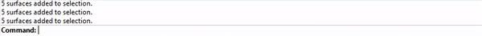
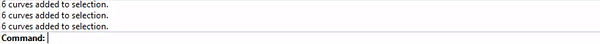

# Rhino ➡ Revit

Stream Rhino geometry directly into Revit as BuiltElements with Speckle 2.0! In this tutorial, we'll send some basic surface and curve geometry from Rhino into default floor, wall, and column families in Revit.

## Tutorial

Before getting started, check that you have a supported version of Rhino and Revit and the Speckle 2.0 connectors installed. Then, download the Rhino file for this tutorial [here](./img-interop/rhino-revit-model.3dm).

 1. Open the Rhino file. The model is organized into a `Structure` layer for columns and an `Architecture` layer for floors and walls.
 2. Pull up the Rhino Desktop UI by typing `Speckle` in the command line. 
 3. Create a sample stream `domino-house`. We'll use this stream to send objects from Rhino into Revit.
 4. Open a new Revit file, and call up the Revit Desktop UI via the Speckle 2 plugin ribbon. Add `domino-house` to the file's streams.

### Send floors and walls with the automagic method

The automagic method decides which schemas to apply to your selected geometry based on object and layer names, as well as geometry type. We'll test this method out on our architecture elements, which are already organized into sublayers by their schema type.

 1. Right click on the `Architecture` layer and select all objects on all sublayers.
 2. Type `ApplySpeckleSchema` in the command line. The `Automatic` option is `On` by default. Press **Enter**.
 3. Navigate to any floor or wall surface and view the object's User Attribute Text (AUT) property panel. You should now see a `SpeckleSchema` entry with a `Floor` or `Wall` value.
 4. Swap the Rhino `domino-house` card to sender mode, select all floor and wall objects, set the selection on the card and click `Send`.
 5. In Revit, click the `Receive` button on your Desktop UI stream card, and watch the Rhino surfaces come in as floor and wall family instances!

### Send columns with the manual method 

Next, we'll send the columns by selecting the `Column` schema directly in the schema command.

 1. Select all column lines in the `Structure` > `Curves` layer in Rhino.
 2. Type `ApplySpeckleSchema` in the command line and set `Automatic` to `Off`. Press **Enter**.
 3. The command now shows two options. Make sure `DirectShape` is set to `Off`, and click on the `Schema` option to change the schema to `Column`.
 4. Press **Enter**. All lines now have the column SpeckleSchema entry in their AUT property!
 5. Send the lines from Rhino to `domino-house` as before, and click `Receive` in Revit - the lines are now Column family instances in your Revit file!

## Remarks

Detailed information on the Rhino schema commands used in this tutorial can be found under the `Advanced User` section in the Rhino User Guide.

To remove schemas applied during this tutorial and start over:

1. Type `RemoveSpeckleSchema` in the command line
2. Select objects to remove schemas from
3. Press **Enter** - Speckle AUT strings are now deleted from all selected objects!
