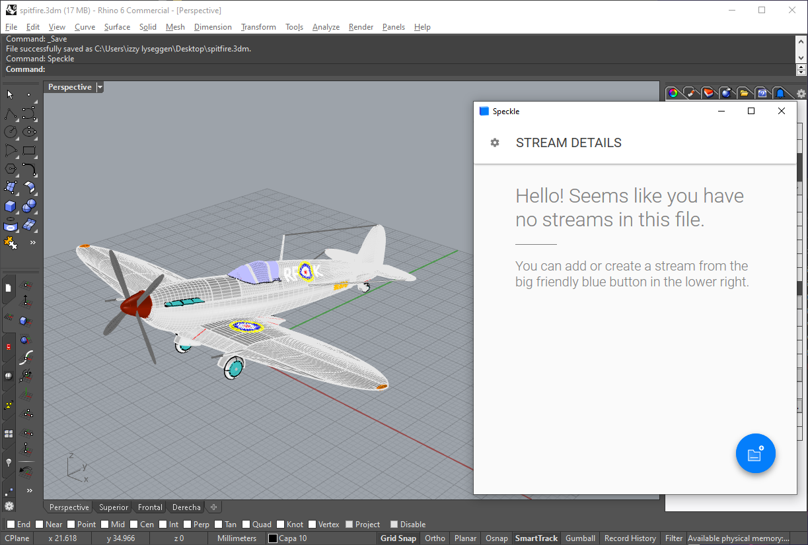

# Interoperability

## Prerequisites

These guides presumes you have already installed the connectors, created a Speckle account, and added it to the Manager. If you haven't done this, please follow the steps in the [Manager Guide](/user/manager)

## Grasshopper ➡ Revit

This section is work in progress 🚧 ! Please check back again soon 😃

## Revit ➡ Grasshopper

This section is work in progress 🚧 ! Please check back again soon 😃

## Rhino ➡ Revit

### From Rhino

#### Opening the Connector

#### Creating a Stream

#### Adding Some Objects

#### Sending Data

### To Revit

#### Opening the Connector

#### Adding a Stream

#### Receiving Data