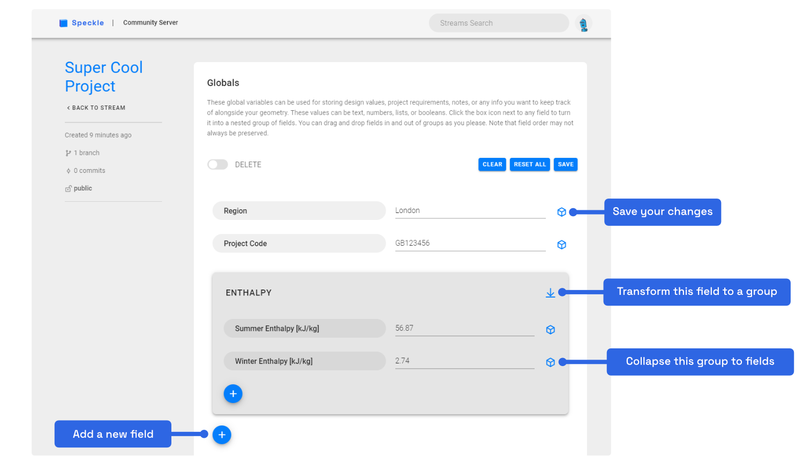

# Speckle Web App

## Introduction

The **Speckle Web App** is our browser-based interface for managing all things Speckle. It is your one stop shop for:

- Managing your streams and their viewing / editing permissions
- Coordinating your data among various parties & users 
- Creating and editing streams
- Viewing your data in our 3D model viewer
- Managing your account
- Sharing your data with others

When you first visit your speckle server address (e.g. our default [speckle.xyz server](https://speckle.xyz)), you'll be prompted to log in or register to that server. Servers are independent of each other meaning if you are a part of multiple Speckle Servers, you'll need to create a new account for each one.

::: tip IMPORTANT 🙌
This guide assumes you have access to a **Speckle Server**.
If you don't have one provided by your company, you can use our [free Speckle server](https://speckle.systems/getstarted/).
:::

## Streams

Once you're logged in, you'll be greeted by the home page which shows your [streams](/user/concepts.html#what-are-streams) and a feed of recent activity on the left.

These streams are the ones you have access to including streams you've created and streams you have been added to as a [collaborator](/user/concepts.html#who-can-i-share-them-with). Each stream shows you a brief summary of the stream including its name, the number of [branches](/user/concepts.html#branches) & [commits](/user/concepts.html#commits), when it was last updated, and who has access to it. Clicking any of the streams will take you to the details of that particular stream. You can also click the big blue button to create a new stream.

### The Streams Page

👉 Psst - need a streams refresher? [Let's go!](/user/concepts.html#what-are-streams)

On a stream page, you can browse the existing commits and view the data in our lovely 3D viewer. The most recent commit is the one you will initially see in the viewer. 

If you have _contributor_ access, you can also add new branches and commits to the stream. If you have _owner_ access, you will see additional buttons which will let you edit the name / description, configure link sharing, and manage collaborators.

By clicking on any of the latest commits you'll be taken to that commit's page.

::: tip NOTE

The list of recent commits by default refers to the `main` branch. You can swap branches by using the dropdown at the top of the page.

:::

## Branches

🤔  Wait, what were branches again? [We gotchu!](/user/concepts.html#what-are-branches)

Each stream contains a little branching-icon button to help you easily switch between a stream's different branches. By default, each stream will contain only one branch, called **main**.

By clicking on the **Branches** button you'll be taken to a page that lists all existing branches for the current stream.

From here you can access each branch's page or create new branches.

### The Branches Page

By going even deeper, you can access a page for a single branch in your stream. This will display all of the commits that have been pushed to it, and you can edit the branch name and description too. This looks like:

## The Commit Page

Clicking on a particular commit will take you to a new page where you can view the commit in the viewer and explore the commit object.

The "Data" section on this page allows you to explore the commit object by expanding it. The top level [_Base_](/user/concepts.html#the-base-object) is the root commit object and each item within it is a property. Properties can either be simple values (like the id, speckle type, and children count), another object, or a list of objects.

Clicking on one of these lists will expand it and show you all the objects nested within it. If a nested object is a "Referenced Object", this means it is a separate object that hasn't been loaded yet. You can click it to load the referenced object and get more details. Clicking on the little arrow button next to an object will open that particular object in a new page and display it in the viewer.

## 3D Viewer

Speckle's built-in **3D Viewer** lets you visualise and interrogate your geometric data right in the browser. You can use the viewer to visualise a whole commit or just a specific object.

Use your left mouse button to rotate the view around and use the right mouse button to pan. Double clicking on an object will bring it into focus and double clicking on the background will bring the whole scene into view.

Try playing with our embedded 3D viewer below to get a feel for navigating a model and inspecting its elements in your browser.

<iframe src="https://speckle.xyz/embed?stream=a632e7a784&branch=roof" width=600 height=400></iframe>

The toolbar at the bottom edge of the viewer allows you to:
1. Select a canonical view (such as Top, Front, Left)
2. Focus the whole scene
3. Cut the view with a section plane
4. Open a help menu if you need a reminder of the controls

## Globals

Want to keep track of project information, design values, notes, or any other general info alongside your geometry? Each stream can have a set of global variables which can do just that! These globals could be things like site region, building height, maximum areas, summer / winter temperatures, etc - your imagination is the limit! 

These globals can then be accessed from your scripts or applications to plug right into your calculations or get pulled into reports or spreadsheets. You can also look back at the history and see who changed what and why.

To build or edit a stream's globals, click the "Globals" button in the stream sidebar.

This will take you to the interactive globals editor. Here, you can add new fields with the ➕ button and fill in their info. You also have a toolbar on the top right to "clear" (delete all the fields / groups), "reset all" (undo all your changes), and "save" your changes with a message.

Any field can be transformed into a group by clicking the box button on the right. Any group can also be flattened by clicking the collapse button on the right of its name. You can drag and drop any field or group anywhere you want within the editor to build the structure you want!

If you need to delete a field or group, toggle on "delete" mode and click the big red buttons.

Each time you hit "save", you'll be prompted to add a message along with your changes. This will be saved to the chronological history which you can see at the bottom of the page. You can click on any of these messages to go back see the globals from that point in time.

::: tip NOTE 

Globals currently do not support detached objects. Let us know on the forum if this is something you would want!

:::

## Profile

Click on your profile image to head to the **Profile** management page. If you haven't added a profile pic yet, we've auto-generated you a nice little robot avatar (you're welcome :smile: ) 

From your profile page, you can edit your personal details and manage your authorised applications in the "Your Apps" section. These are the applications that you have granted access to your streams and profile. On this page, you can make sure you recognise all the apps and easily revoke access to any apps you no longer want to authorise.

Further down the page are some more advanced options intended for developers. You can check out the GraphiQL Explorer where you can explore the API and interact with your live data. You can generate Personal Access Tokens which are like passwords you can use to authenticate in your scripts and apps. You can also register your own Apps so other people on the server can use them too.
